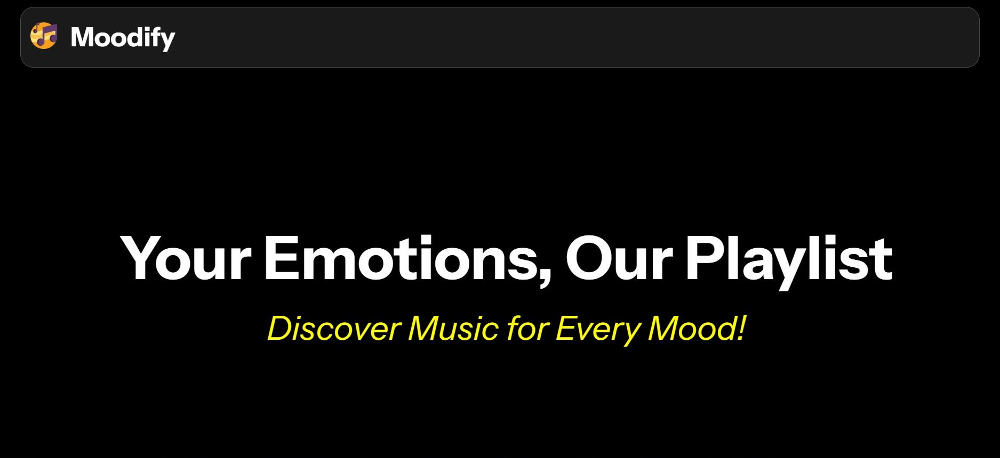
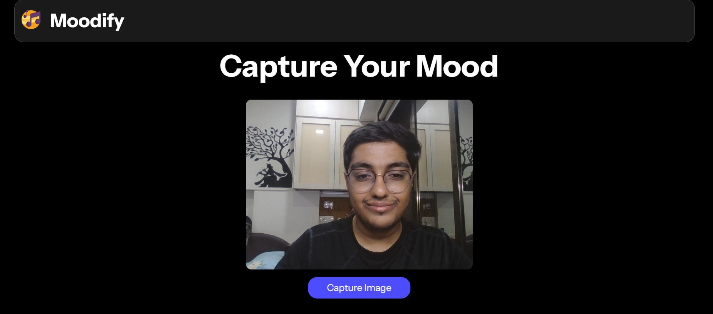
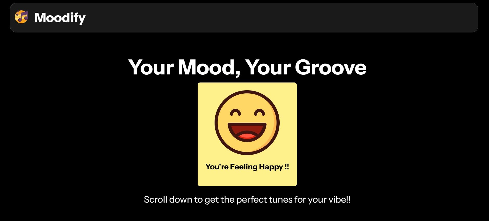

# Moodify - Discover Music For Every Mood

Moodify is an intelligent emotion-driven music recommender that fuses AI emotion detection with the Spotify API to craft playlists that match your current mood.
With just one click, Moodify analyzes your facial expressions in real time using TensorFlow and Face-API.js, detects one of seven emotions — angry, disgusted, fearful, happy, neutral, sad, or surprised — and instantly generates a playlist that resonates with how you feel.

Over time, Moodify learns your listening patterns and refines its suggestions, offering a personalized, emotionally immersive listening experience.


## ✨ Features

🎭 Real-Time Emotion Detection
Uses webcam input and Face-API.js to detect your current mood instantly.

🎶 AI-Curated Playlists
Connects to the Spotify API and fetches songs matching your detected emotion.

🔒 Secure OAuth Authentication
Seamless and secure user login using Spotify OAuth API for playlist generation.

🧠 Adaptive Learning
Learns from your listening history and emotional patterns over time.

💡 Modern, Responsive UI
Built with ReactJS + Tailwind CSS for a clean, vibrant, and responsive design.


## Tech Stack

**Frontend:** ReactJS, Tailwind CSS, Face-API.js

**Backend:** NodeJS, ExpressJS

**AI Model:** TensorFlow.js (Emotion Detection)

**Music API:** Spotify Web API

**Authentication:** Spotify OAuth 2.0


## How It Works?

1. Emotion Detection 
* User enables webcam access.
* Face-API.js analyzes facial expressions using pre-trained deep learning models.
* The system classifies emotion into one of seven categories.

2. Mood Mapping
Each emotion is mapped to a specific mood-based playlist theme.
For example:

😄 Happy → “Good Vibes Only”

😢 Sad → “Rainy Mornings”

😠 Angry → “Let It Out”

😐 Neutral → “Focus Flow”

3. Playlist Generation
* App connects to Spotify API via OAuth.
* Fetches curated tracks or user-based recommendations.
* Displays the playlist in-app with embedded Spotify player.

4. Personalization Engine 
* Tracks listening patterns.
* Adjusts recommendations dynamically based on emotion frequency and skips.

## Screenshots






## Installation

Clone the repository

```bash
  git clone https://github.com/karansanghvi/moodify.git
  cd moodify
```

Install Dependencies
```bash
  npm install
```

Create a .env file in the directory
```bash
  SPOTIFY_CLIENT_ID=your_client_id
  SPOTIFY_CLIENT_SECRET=your_client_secret
  REDIRECT_URI=http://localhost:3000/callback
```

Run the app
```bash
  npm start
```
    
## License

This project is licensed under the MIT License – free to use, modify, and share.

